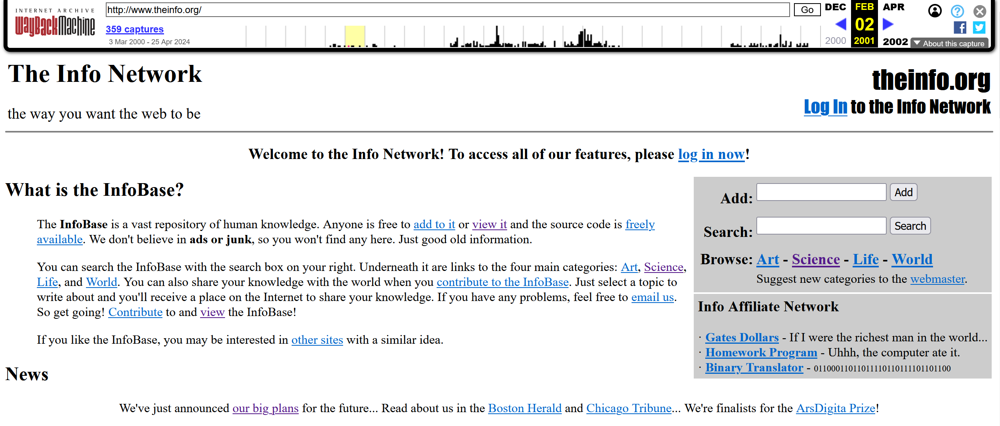
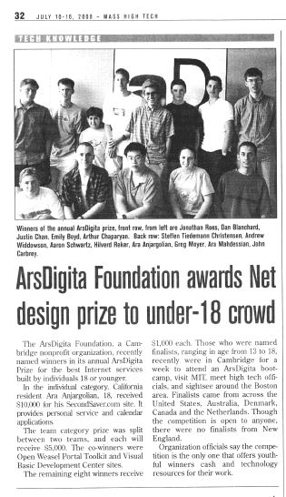

>  What is the most important thing you could be working on in the world right now? ...and if you're not working on that, why aren't you? ---Aaron Swartz

二零一三年的一月十一日，我像往常一样打开Hacker News，准备在开始一天的工作之前阅读当天黑客社区里的热点新闻，头条页面的一则新闻吸引了我的注意力：这是一则来自tech.mit.edu的简单讣告：Aaron Swartz commits suicide。这是我第一次听到这个名字。作为一名系统程序员，当时的我对飞速发展的互联网领域的前沿进展知之甚少。我开始浏览网友的留言，慢慢的了解了Aaron精彩、曲折、令人振奋而又惋惜的一生。在那个晚上我被改变了。此后的许多年里，每当我看到他的名字，他的报道，人们对他的纪念文章时，我都在心中反复默念一个词：自由。作为第一期的技术考古学播客，再没有比它更合适的主题了，因为自由是人类文明发展重要的主题，是我们每个人毕生追求的目标，它是创新的前提，也和创新中的其他部分紧密相连。让我们开始今天的考古，把时间拉回一九八六年。
**切换音乐**

一九八六年，Aaron Swartz出生在Illinois州的Highland Park的一户犹太人家庭。这是一座距离芝加哥40公里的小城。而Aaron的父亲实际上也是一位创业者，他的公司Mark Williams Company创立于1977年，公司的产品是Unix操作系统的闭源克隆版本Coherent，运行在IBM PC上，同时公司也开发了很多版本的C语言编译器。在1995年，由于Linux在开源社区的风行，类似MWC这样的提供商用Unix操作系统的公司渐渐无法维系，于是Aaron的父亲不得不在1995年关闭了自己的公司。Aaron的父亲在他很小的时候就送给他一台初代Machintosh。毫无疑问，这台电脑以及父亲的影响使得早年的Aaron就开始大量阅读关于计算机、互联网、以及互联网文化的文章和网页。之后，Aaron开始加入了一些邮件列表，当潜水足够长时间之后，他开始加入讨论。接着他开始阅读网页源码并尝试自己制作网页。随着经验的积累，Aaron已经能够熟练地不仅开发网页，而是网页应用了。这时他十三岁。

很多研究表明一个人十四岁的音乐品味会影响他一生的音乐品味。我相信对于技术而言也是如此。在1999年，十三岁的Aaron开发的第一个严肃作品就是一个网页应用：theinfo.org。这个应用基于这样一个想法：我们需要一个在浏览器上运行的免费的、支持多人共同创作、编辑、和排版的在线百科全书。Aaron独立完成了网站的架构和所有功能，提供了不同浏览器的支持。在Internet Archive的Wayback Machine上，至今你仍然可以看到theinfo.org的界面，内容，新闻，以及当年的用户提交的页面。

The Info Network，你期望的互联网该有的样子。一个巨大的人类知识库。任何人都可以免费添加，查阅信息，代码完全开源。Aaron Swartz使用了tcl语言实现了所有网页的显示和动态功能，包括编辑和搜索，以及adp语言实现了一个小巧的数据库。几个顶级文章分类包括：艺术、科学、生活、和世界。如果你是一个从那个时代就混迹互联网的老兵，那么这些描述和站点的界面不得不令你想到另一个改变世界的网站Wikipedia。只不过在1999年，Wikipedia尚未公开。这可以说是Aaron Swartz完全独立创作的主意。这个网页为他赢得了当年的第二届ArsDigita网页开发大赛未成年组的提名奖。我找到了当时刊登在芝加哥当地报纸上的一则新闻，在其他十七八岁参赛者当中，Aaron Swartz是那个最矮的胖乎乎的小个子，一头黑发，眉毛浓密，看起来最为显眼。

在采访中，他说到：“我厌倦了充斥互联网的广告栏、赞助商广告、和其他毫无价值的垃圾内容。互联网诞生不是为了这些。万维网是基于开放协议和标准的，它是自由的。我希望在互联网时代给人们最真实的信息和知识。一个免费的知识库，就像GNU/Linux操作系统的精神一样。”事实上，这个项目开始于两个夏天之前（Aaron只有11岁），他厌倦了学校的教育方式，开始在电脑上慢慢探索和实现自己的想法。他意识到，在互联网上发表、编辑、和分享知识和观点并不是一件容易的事情。“你需要架一个服务器，学HTML，或者使用网页编辑软件。”于是他开始了theinfo.org的项目。整个项目在一台Apple iBook上编写完成。此时的Aaron已经有了成立自己的软件公司的想法：“我还希望成立一家软件公司，它的所有产品对所有人都开源。现在，人与人的交流非常低效，我们需要让程序之间自动通信和交互。”我在收集资料的时候经常以为自己在写一位成年人的创业想法，事实上，我不得不反复提醒自己，时间是1999年，而Aaron只有十三岁。事实上，如果你在此刻询问ChatGPT这样的问题：What is the spirit of the Internet。你会得到这样的回答：开放与自由，去中心化，协作与连接，创新与进化，平等访问，隐私与安全，社区与赋权。回到Aaron，你会看到即使在只有十三岁的年纪，Aaron从第一个项目开始就已经围绕着如何确保真正的互联网精神不被损害而战斗了，而这一战斗，也将伴随他的一生。

在theinfo.org获得更多认可和关注的同时，Aaron已经开始计划他的第二个个人项目：MyInfo。一个可以根据用户的喜好自动配置的软件，从互联网上收集相关的新闻文章。没错，这就是RSS的想法。
**切换配乐**
RSS，RDF Site Summary，或者Really Simple Syndication，是最早的feed流。可以说它定义了现今互联网上人们获取信息的主流方法：根据自己的兴趣，设置对不同新闻和博客源网站的订阅，以便在用户的客户端统一查询不同来源的信息。用现在的小朋友能听得懂的语言，就是微信的公众号。RSS将对新闻源的定时查询和更新第一次做到了完全自动化，在移动时代来临之前，甚至2010年之后的相当长一段时间里，RSS仍然是那些希望自己掌握新闻和阅读品味的用户最爱的选择。Aaron又一次独立实现了MyInfo的所有功能。当他想公布自己的网站时，他突然意识到自己并不是最早想到这个主意的人。Syndication，一个新闻界的术语，代表将报纸杂志的文章、摄影作品、电视节目打包出售给不同媒体发表的行为。在互联网语境里，内容提供方就是博客和新闻网站，而内容的消费方就是用户。出售这个行为被改成了使用程序自动完成。Aaron开始关注一个叫RSS的小组，他们正在邮件列表里策划共同实现一个开放标准RSS 1.0。理所当然的，他加入了这个组织。
**切换配乐**
在漫长的暑假里，Aaron开始阅读RSS 1.0邮件列表里的所有文章，并接受任何请求，提供帮助给各种奇奇怪怪的边角工作。他成为了RSS 1.0的共同作者。接着他又成为了RDF标准，一个万维网联盟提出的标记语言的技术规范的共同作者，和万维网的发明者Tim Bernard Lee共同工作。加入这样的万维网联盟组织意味着每周的电话会议、频繁的邮件列表讨论，以及时不时飞去陌生的城市参加线下聚会。从这里开始，Aaron从高中退学，除了在家中自修一些大学级别的课程之外，他开始结识现实世界里年龄比他大得多的开发者，也在社区会议上发言甚至做报告。一次会议中，他认识了哈佛大学的法学教授Lawrence Lessig，他正要成立一个非营利性组织，提供一系列创意、著作和版权的许可协议。这就是在今天为人熟知的Creative Commons。Aaron推荐CC使用RDF作为标记语言，并且发邮件详细阐述了好处。Lessig教授的回复是：好主意，不如你来帮我们实现它吧。就这样，Aaron也成为了Creative Commons最早的组织者之一。作为一个高中辍学生，这样的成就可以让很多人满足。但是Aaron在几年后，停止了在W3C下的所有工作，至少在他2004年共同发明Markdown语言之前，他暂停了这方面的工作。因为，他要上大学了。而他要去的地方，将进一步成就他：加州，硅谷，斯坦福。
**切换配乐**
Aaron这样描述斯坦福：斯坦福是一所加州的名校，阳光总是明媚，草坪总是翠绿，人们总是有着健康的棕色皮肤。我从很多著名的教授那里学到了很多，但是我并不觉得这里的学术氛围很浓厚，大多数人对自己的学业并不关心。很多朋友可能会对此持有怀疑态度，不过在美国读过博士，也在硅谷生活过的我可以告诉大家，Aaron的这种描述对于美本学生来说并非不可能。斯坦福研究院的学术氛围和本科并不相通。圣诞前后，一封改变Aaron和整个互联网命运的邮件来到了他的邮箱。发信人是Paul Graham，一位成功的程序员，企业家，作家，硅谷的创业教父，他的故事我以后有机会也可以讲。Paul Graham在邮件里写道，他正要开始一个新的个人项目：Summer Founders Program。想法很简单：召集一批非常聪明的程序员，将大家都送去Boston度过一个暑假，并给他们资金支持，用来成立很多科技创业公司。这批程序员/创始人将会非常努力的实现一些很酷的想法，而组织者的职责是教会这些未来的企业家们所有关于商业的知识，并把他们介绍给著名的投资人和机构。这就是著名的创业孵化器Y Combinator的前身。YC现今已经广为人知，但是可能很少有人知道这个名字的由来。Graham除了是一位程序员之外（他开发了lisp的一种方言），他还对数学和计算机科学的基础概念非常痴迷。Y Combinator是Lambda演算里的一个非常基础的概念。Lambda演算是一种用来研究函数定义、函数应用和递归的数学系统。在这个系统中，每个函数都有一个固定点，Fixed Point。这意味着对于某个函数f，存在一个x值，使得应用函数f到x上得到的结果还是x。比如$f(x)=x^2$的固定点有两个：0和1。而Y Combinator就是用来找到这样的fixed point的工具。这样一来，使用Y Combinator就可以支持函数实现递归的功能，即它能帮助函数调用自身。了解了Y Combinator的含义，我们就知道Paul Graham希望表达的隐喻：他的加速器旨在帮助初创企业找到自身的成长和可持续发展的道路，就像Y Combinator帮助函数找到它的Fixed Point一样。Aaron把这个夏季项目视为逃避无聊大学生活的手段。他提交了一份计划书：他的项目叫Infogami。苹果Macintosh电脑彻底改变了人们使用电脑的方式。人们不必再使用终端指令和电脑交互，而是可以使用鼠标和图形界面进行更丰富的交互。Infogami就像网页开发的Macintosh。Aaron在剑桥度过了一个周末，经过选拔，他的项目被选中了。春季学期结束后，Aaron来到MIT的一个闷热的房间里，开始和匹配到的一位荷兰程序员一起开发Infogami。然而，随着开发的深入，Aaron作为一个合作者和管理者的缺陷逐渐显露。他无法信任同伴的代码，经常自己重写全部模块。终于，荷兰程序员退出了项目，而Aaron也几乎就要退出。在决定离开之前，他找到了Paul Graham。“如果我这周末之前我没法拿到funding，找到一个新的合伙人，或者租到一个带空调的公寓，那我就会退出。”18岁的Aaron终究还是个孩子。Paul成功的说服他留了下来。“你可以和其他项目合并，这里有一个项目缺少合伙人：reddit。”
**切换音乐**
Reddit是一个社交网站，类似百度贴吧。Aaron和两位Reddit的co-founders成立了一家新的umbrella company: Not a Bug。他开始用python重写大部分的网页系统和数据库系统。Reddit上线之初毫无流量，但是随着时间的推移，几个月的时间内累积了百万用户。接着就是每月增加几百万用户。大的新闻站点开始注意到Reddit，发现可以通过在自己的站点上添加一个reddit it按钮来为自己引流。接着，合作的讨论渐渐变成了收购。几个合同在即将敲定之前被取消。大家都因为要考虑盈利而接近疯狂，有创意的工作也越来越少。Aaron回忆至少有六个月他们没有在技术上对reddit做任何提升。Aaron开始对这一切无法适应。2005年，他在博客里写道：我太社恐。我非常善于管理自己的时间，但是对参与各类活动和与同龄人交朋友毫无能力。我讨厌内卷。一天，他拿了一个睡袋，像一个流浪汉一样在哈佛广场的长椅上睡了一晚。“我的爷爷是个资本家，我的父亲是个资本家。我在全美第六富的城市读小学初中，在第三富的城市读高中。”Aaron对自己认为自己创造的价值和公司实际获得的估值之间巨大的反差产生了强烈的自我否定。对于Reddit，Aaron这样评价：你可以说这个网站很酷，很傻，很流行，很有创意，或者是个老掉牙的主意。但是有一件事大家都忽略的是：这个网站并非一个严肃的项目。当然，像所有最终成名的硅谷初创公司一样，这件事情的结尾是皆大欢喜。最终，一家大的出版公司Conde Nast，也就是连线杂志的母公司收购了reddit。收购当晚，其他人在哈佛广场庆祝，给路人派发免费的reddit t-shirt，而Aaron则很平静，甚至有些木然。然后当创始团队去附近的酒吧继续庆祝的时候，Aaron静静的离开了人群。“我回家看了一部关于连环杀手的片子，然后睡觉。”收购的价格是两千万美金，作为联合创始人，Aaron拿到了数百万美金的回报。Aaron和其他人一起搬到旧金山，开始在连线公司的办公室继续工作。然而，他这样写道：“第一天看到这个像棺材一样的办公室和叽叽喳喳的同事，我就崩溃了。午饭后我独自在浴室长椅上流泪。”Aaron的行为多少有些戏剧化。按照一般成年人的标准来看，Reddit并没有什么特别的问题。但问题在于它是一份工作，而这正是Aaron难以接受的地方。拥有一份工作意味着要把自己的个人优先考虑置于雇主的利益之下，放弃自己的抱负，专注于完善产品。不幸的是，Aaron并不相信这个产品，他也不擅长假装相信。他很快从在办公室哭泣变为完全避开办公室。他在家工作，如果他还算在工作的话。2006年12月，他前往欧洲参加一次计算机会议，但并没有告知同事他的计划；他的行踪是在他作为会议与会者的照片出现在《连线》网站首页时被曝光的。会议结束后，他没有返回旧金山，而是回到波士顿，蜗居在他以前的公寓，并开始阅读大卫·福斯特·华莱士的小说《无尽的玩笑》。他的行为已经无法再被reddit的同事们容忍。事实上，过去两年里，他一直在违背自己的本性，按照别人的指示走不熟悉的路。看起来，他似乎迷失了。在剑桥的公寓里，他写了一个短篇故事，一个叫Aaron的年轻人在失业后自杀的故事，发在他的博客上。Aaron的家人看到这篇文章后十分担心他的精神状态，于是报了警。就在警察闯进公寓之前，Aaron从那里逃走了。终于，2017年初，他收到一封需要他签字的辞职信。是时候离开reddit了。
**切换音乐**
沐浴在旧金山的阳光里，Aaron重新有了自由的感觉，然而像Aaron这样的人只要还活着，就需要新的项目去完成。在斯坦福的图书馆里，Aaron开始准备把过去对心理学的兴趣转化成一本书，指导了两个当年的Google Summer of Code项目，同时和一些之前RSS以及万维网联盟时期结识的老友开始重新联系，为Open Library这个最早开始尝试将重要的书籍电子化并公开免费提供的网站开发了最早的版本。这里值得一提的另一个项目是：他和过去在Infogami的co-founder一起使用Python编写了全新的基于markdown语法的在线内容管理系统：Jottit。这个项目沿袭了Aaron希望把在线出版，也就是创建个人主页这件事情更加民主化的思想。包括从技术上降低门槛，使人们不必掌握html就能轻松编写页面内容，以及从发布流程上，尽量简化并遵循去中心化的思想，让所有内容发布者不必集中在一个平台。这个项目至今仍然对互联网内容创作和发布工具和平台有着深远的影响，我们看到之后Medium, WordPress, Substack, Wix到今天的Vercel, Notion, Github Gist都在不同的方面延续着Aaron的使命：让最多的人，用最简单的方法，最快速的将自己的想法发布到互联网上分享给整个世界。另外，Aaron开始尝试进行严肃的新闻稿件撰写，他发表的第一篇研究论文就是关于维基百科的编辑方式的研究。这项研究发掘了维基页面内容编辑的真正来源：大量的外围贡献者，他们一次性为某个页面或主题提供核心的内容，而维基的委员会常规编辑们虽然有着数百数千倍的编辑行为，却更多围绕格式和引用来源。总之，财务自由之后的Aaron，能够更加自由的去追随自己的兴趣，产生更大的价值。而就是从这一年开始，他开始踏出程序员的边界，成为了一个政治活动家。这一切都来自那篇著名的Guerilla Open Access Manifesto。
**切换音乐**
“信息就是力量。但就像所有力量一样，有些人只想占为己有。世界上所有的科学和文化遗产，已在书籍和期刊上发布了数个世纪，正渐渐地被少数私有的公司数字化并上锁。”这是Guerilla Open Access Manifesto的开篇。“遵从不公正的法律不会带来公正。步入光明的时候到了，在公民不服从的伟大传统下，宣告我们对这种私人盗窃公共文化的反抗。我们要夺回信息，无论它们被存在何处，制作我们的副本并和全世界分享。我们要取到版权到期的东西并将它们归档，我们要买下秘密的资料库并将它们放到网上。我们要下载科学期刊并将它们上传到文件分享网络。我们要为游击队开放访问而战。只要全世界有足够多的我们，那就不仅是传达了一个反对知识私有化的强有力信号，我们还将让它成为过去。你愿意和我们一起吗？”这是这份令人振聋发聩的宣言的结尾。在各种意义上，它都几乎标志着Aaron的悲剧结局。这是个人对抗体制的宣战，是游击队员的号角，也是Aaron Swartz殉道者之路的开始。
实际上，Aaron在他勤于维护的博客里早已不止一次地透露出对版权和自由的看法。比如，在2006年四月的《何为知识分子》一文中，Aaron这样写道：“它是不仅接受事物的表面，还想去思考、去理解的倾向。不仅仅满足于感到悲伤，还要去思考悲伤的意义。不仅仅是买一张公交卡，还要思考为什么从经济角度看买公交卡是合理的。我把这种倾向称为“知识分子”特质。......语言是思想的媒介，因此不奇怪一个花大量时间思考的人也会花大量时间思考如何表达他们的想法。而事实上，我想到的所有知识分子都会写作，不是因为他们必须写或因为他们得到报酬，而是纯粹为了写作本身。如果不能分享思考的成果，那思考又有什么意义呢？”。在2004年一月（此时他只有17岁）的《下载并非盗窃》一文中，他写道：“盗窃是不对的，但下载并不是盗窃。如果我从当地的唱片店偷走一张专辑，其他人就买不到它了。但当我下载一首歌曲时，没有人因此失去它，反而是另一个人得到了它。这在道德上并没有问题。......下载可能是违法的，但6000万人使用过Napster，而只有5000万人投票给布什或戈尔。我们生活在一个民主社会。如果人们希望分享文件，那么法律应该随之改变。”我认为最精彩的一篇，是他在四天后的2004年一月十二日写下的《杰佛逊总统：大自然希望信息能够免费》，其中他这样写下杰佛逊总统当时的想法：没有人会认真质疑私有财产的合理性，但认为思想应该成为私有财产却是荒谬的。自然显然希望思想是自由的！虽然你可以把一个想法保留在自己心里，但一旦你分享出来，任何人都可以拥有它。而一旦他们拥有了，即使他们想摆脱它也很难。像空气一样，思想无法被锁住或囤积。不管有多少人分享这个想法，它都不会被削减。当我听到你的想法时，我获得了知识，而不会减少你拥有的任何东西。同样的道理，如果你用你的蜡烛点亮我的蜡烛，我得到的光不会让你变暗。像火一样，思想可以遍布全球，而不会减少其强度。因此，发明不能成为私有财产。当然，我们可以给予发明者独享利润的权利，或许是为了鼓励他们发明有用的新事物，但这是我们的选择。如果我们决定不这样做，没人能反对。Aaron引用这位美国第三任总统，也是独立宣言的主要作者，对知识产权的看法是为了说明他自己的想法和这位总统的相似性：第一，本质上讲思想不能称为私有财产，第二，政府没有义务为其制订法律，最后，美国的法律在这方面不算非常成功。通过这些短文的匆匆一瞥，我们可以看到，年轻的Aaron不仅仅坚定的信仰信息和知识产权自由开放的想法，并且已经表达了要为改变不合理的法律做出行动的意愿。而Guerilla Open Access Manifesto，只是他接下来转变为一位政治活动家的序曲而已。
**切换音乐**
Aaron的第一个大规模Open Access行动是针对美国的公共法庭电子记录系统，简称PACER。PACER由美国法院行政办公室管理，这些不受版权保护的免费信息在用户下载时会收取8美分费用，而这些费用让这项下载服务有每年1.5亿的预算，但提供的服务却像上个世纪的传真复印画质和速度一般。在加州首府萨克拉门托的几处提供免费下载PACER试用服务的图书馆里，Aaron使用Perl语言编写了脚本，并将它们批量运行在AWS的数个计算节点上，源源不断的下载了二百七十万份法庭电子记录文件并将它们实时传输给了一家分享美国免费公众信息的非营利性网站：Public Resource Org。这次行动也为Aaron招致了FBI的注意。但是，由于下载的文件本身是公共文件且不受版权保护，FBI经过调查，并未起诉Aaron。时间来到2010年，这一年，Aaron参与创办了Demand Progress，一个致力于维护公民权利，督促政府改革，以及促进免费公开的在线信息的组织。这一组织很快演变成最大的在线请愿平台，帮助人民反对任何威胁互联网自由的政府提案。而这一组织成立后第一次大规模的反对提案就是著名的《网络盗版法案》。这项法案旨在打击互联网上的版权侵权行为，虽然初衷无可指摘，但由于该法案的实施可能让美国政府更容易关闭被指控侵权的网站，并给互联网服务提供商带来不可容忍的负担而遭到广泛的批评。在该法案被击败后，Aaron在2012年5月在华盛顿特区的自由连接2012活动中发表主题演讲《我们是如何组织SOPA的》：“我给所有朋友打电话，我们通宵搭建了一个新组织，并发起了一个反对该恶法的在线请愿书......我们获得了三十万名签署者......我们与国会议员的工作人员见面，并组织了该法案的实施。”他补充道：“我们赢得了这场斗争，因为每个人都把拯救这一重要自由当作自己的责任”他指的是众多网站对该法案的抗议活动，这些抗议被电子前沿基金会称为互联网历史上最大规模的抗议活动，据非营利组织Fight for the Future统计，有超过115,000个网站参与其中。这里需要提一下Aaron Swartz和维基解密的关系：2013年1月，在Aaron去世后不久，维基解密称Aaron Swartz曾帮助过维基解密，并在2010年和2011年与朱利安·阿桑奇有过交流。维基解密还表示，他们“有充分理由相信，但无法证明”Aaron可能是维基解密的爆料人之一，虽然这可能违反了维基解密关于来源匿名性的规定。但维基解密发表这些声明可能是为了暗示Swartz是被美国检察官办公室和特勤局针对的目标，目的是追查维基解密。可以看到，随着Aaron开始深度参与各项与美国政府以及公民权益密切相关的法案推进和抗议活动，他也逐渐成为了真实世界里美国政府眼中的全民公敌。一切的一切，都在最后一个案子中纠缠在一起，导致了Aaron悲剧的死亡。
**切换音乐**
摄像头正对准一间黑暗的房间，只有居中的门框周围漏进来光线。几分钟后，有人推开门，进屋，开灯。这是一间布满线路和机器设备的房间。来者留着过耳长发，身披黑色呢子大衣，背上是一个鼓鼓囊囊的双肩包，在一侧的肩带上还系着一个自行车头盔。他迅速的掏出包里的一个盒子，取出里面的一架移动硬盘，在画面外进行了十分钟左右的配置，随后带着一个之前的移动硬盘，关灯，离开了这间屋子。这是Aaron Swartz，地点就在MIT的某处网络设备杂物间，而监控摄像头是在学校方面查到这个节点的网络IO出现异常后，不动声色的放置在那里的。目的就是为了进行钓鱼执法，获取Aaron Swartz的所谓：罪证。然而，在2011年，Aaron已经成为了一个非常忙碌的政治活动家，他参与创办了很多组织，并领导了更多的抗议活动，甚至在采访中，他自己也声称："I'm not going to waste my life fighting over a little issue like copyright. Health care, financial reform, those are the issues that I work on. Not something obscure like copyright law." 那么，是什么契机导致已经在关注更重要的改革话题的他，把目光投向JSTOR这家为学术科研机构提供论文管理和下载服务的平台呢？
**切换音乐**
时间回到2008年，在Guerilla Open Access Manifesto发布前两天，Aaron在意大利中部一个有着800年历史的修道院，或者你们也可以称作隐修院里，参加一个国际联盟Electronic Information For Libraries举办的会议，讨论如何扩大发展中国家对学术研究论文期刊的获取。修道院这个地点让这次会议本身拥有了一种传教的氛围。大多数与会者多年来一直致力于Open Access问题，或是与发达国家的学术出版机构谈判，或是在欧洲、非洲、亚洲和拉美等地推动这项事业，因为许多学术期刊的价格昂贵的让人无法负担。白天，这个小组会进行紧张的政策讨论，到了晚上，他们会前往附近的小餐馆，享用美酒美食，并畅聊到深夜。这次为期两天的活动中反复出现的一个主题就是对和出版商的谈判以及在线档案的推进进度感到沮丧。学术出版行业的许多人认为，如果他们将订阅费降至几千美元一年，就已经算是“开明”了，尽管这依然让他们的期刊在大多数国家无法被负担得起。JSTOR本身也是一个令人烦恼的来源。作为一个非营利机构，JSTOR在口头上支持学术界的价值观，但在谈判减少其高昂费用时，往往极为不情愿。尽管Aaron在美国一直致力于Open Access问题，他并没有完全理解美国之外的学生和学者如何被如此剥夺信息自由。Swartz在听到这些处于前线的人的发言后，变得非常激动。“富人花费巨额金钱来获取文章，但加纳的研究员呢？坦桑尼亚的研究员呢？柬埔寨的研究员呢？这确实让他开了眼界。” Aaron往往同时处理六七个项目，因此在接下来的几年里，他对期刊问题的兴趣时而浓厚，时而淡漠。但每当兴趣浓厚时，他总能轻松召回他在意大利激发的热情。他经常与他在会议上结识的朋友们通信，并熟悉国际开放获取运动的许多创始文件。例如，2002年的《布达佩斯开放获取倡议》宣言主张：“消除学术期刊的访问障碍将加速研究，丰富教育，分享富人与穷人的知识……并为将全人类团结在一个共同的知识对话和求知的过程中奠定基础。”2010年6月，瑞典出生的学者兼活动家莉斯贝特·拉乌辛（Lisbet Rausing）在《开放民主》（openDemocracy）期刊上发表了一篇广为传播的文章，呼吁开放获取学术文章。她特别提到JSTOR：“JSTOR，那个1997年创建的包含大量二十世纪社会科学和人文学科学术文章的出色数据库，对公众关闭，这同样是个问题，”拉乌辛写道。她进一步说明： “看看JSTOR（如果你能访问的话）。在那里你能找到社会学、人类学、地理学、历史、哲学、古典学、东方学、神学、音乐学、科学史等学科的依据和证据。这些都对公众关闭了。当然，开放高能物理学和弦理论是件好事。但讽刺的是，我们只对那些极少数教授才能理解的学问敞开了大门，更不用说普通公众了。”不久之后，乔治·索罗斯资助的开放社会基金会试图与拉乌辛的阿卡迪亚基金联手，推动JSTOR向公众广泛开放，Aaron也密切关注这些努力。然而，当活动家们得知获取JSTOR完整档案的版权需要数亿美元时，进展停滞了。
最终，2010年9月，仅在他开始下载JSTOR文件的几天前，Aaron出现在布达佩斯的一个谷歌赞助的互联网自由会议上。在会议期间的某个晚上，他与一群活动家一起外出就餐，其中许多人参与了期刊开放运动。他们讨论了让JSTOR向公众开放所需的巨额资金。那次晚餐中没有人提议大规模下载JSTOR，甚至没有类似的想法。正如在意大利的隐修院那样，与会者在谈及版权问题时非常谨慎。Swartz也没有表现出他有任何具体的行动计划。然而，就像在意大利一样，当灵感涌现时，斯沃茨能够迅速且单方面行动。在回到美国几天后，他购买了一台新笔记本电脑，登录MIT的计算机网络，利用自己哈佛大学研究员的身份，开始了JSTOR文件的“解放”。
2010年9月25日，MIT网络中的IP地址18.55.6.215开始向JSTOR网站每分钟发送数百个PDF下载请求，导致网站性能下降。此后，该IP地址被封锁。次日，另一个MIT网络内的IP地址继续发送大量PDF下载请求，导致防火墙对整个MIT的18.0.0.0/8网段进行暂时封锁。2010年9月29日，JSTOR的一名员工给MIT发了一封电子邮件，提到这是极端情况，并指出每小时有超过20万次会话被创建。
不到四个月后，警方依据之前我们提到的监控录像，在哈佛大学校园附近逮捕了Aaron。2011年7月，一个大陪审团以四项罪名起诉了斯沃茨，包括电信欺诈、计算机欺诈、非法获取受保护计算机信息和鲁莽损坏受保护计算机。2012年9月，又增加了九项罪名。Aaron因此可能面临50年的刑期以及超过一百万美金的罚金。2013年1月11日，Aaron Swartz在纽约布鲁克林的公寓内自杀身亡。时年仅仅26岁。在他去世后，联邦检察官撤销了所有指控。2013年12月4日，因《信息自由法》诉讼，特勤局发布了几份与案件相关的文件，包括那段进入MIT网络柜的视频。
**切换音乐**
在Aaron去世后，全世界的网民对他进行了悼念，其中包括Creative Commons的创始人，他最早的伯乐Lawrence Lessig以及万维网的创始人Tim Bernard Lee爵士。Aaron的家人和女友在一份联合声明中说到：“亚伦的死不仅仅是个人的悲剧，它是一个充满恐吓和检察权滥用的刑事司法系统的产物。马萨诸塞州美国检察官办公室和麻省理工学院的官员所做的决定促成了他的死亡。”加拿大著名记者科利.多克托罗这样评价Aaron Swartz:“他兼具无与伦比的政治洞察力、技术技能，以及对人和问题的理解力。我认为他本可以彻底改变美国（乃至全球）的政治。”2013年1月13日，Anonymous组织的成员攻击了麻省理工学院域名下的两个网站，将它们替换为向Swartz致敬的内容，号召互联网社区以他的去世作为Open Access运动的集结号。横幅中列出了对美国版权系统改进的要求，以及Swartz的《Guerilla Open Access Menifesto》。2013年1月18日晚，麻省理工学院的电子邮件系统被关闭了十小时。1月22日，两名黑客将发往麻省理工学院的电子邮件重定向到韩国科学技术院，其他所有流量则被重定向到哈佛大学的一台计算机，该计算机发布了一条标题为“安息吧，亚伦·斯沃茨”的声明，附有斯沃茨2009年发布的一段文字，并伴随着《星条旗永不落》的8-bit版本。大约七小时后，麻省理工学院才夺回了邮件系统控制权。
2013年1月26日凌晨，Anonymous组织攻击了美国量刑委员会网站USSC.gov。在Swartz去世一周年前一周，一名黑客从瑞士一家出版社的网站下载了“数十万”篇科学期刊文章，并在开放网络上重新发布，以此向他致敬。
**切换音乐**
斯沃茨去世的消息引发了支持者发起名为#PDFTribute的活动，旨在促进开放获取。2013年1月12日，世界银行的发展经济学家艾娃·维瓦尔特（Eva Vivalt）开始使用#PDFTribute标签在网上发布她的学术文章，以此向斯沃茨致敬。学者们纷纷发布了自己作品的链接。斯沃茨的故事让更多人关注到科学出版物的开放获取问题。在斯沃茨去世后，许多机构和个人开始为科学知识的开放获取而努力。斯沃茨的去世促使人们呼吁对学术数据进行更多的开放获取。普林斯顿大学的计算机信息技术政策中心（CITP）和Think Computer基金会宣布设立以斯沃茨名义颁发的奖学金。2013年，斯沃茨被美国图书馆协会追授詹姆斯·麦迪逊奖，表彰他作为“公共参与政府事务和无限制获取同行评审学术文章的直言不讳的倡导者”。3月，《图书馆管理》杂志的编辑和编委会集体辞职，原因是与出版商Routledge的争议。一位编委写道，斯沃茨去世后，他因“良心上的危机”而不再愿意在非开放获取的期刊上发表文章。2002年，斯沃茨曾表示，当他去世时，他希望他硬盘上的所有内容都能公开。
Swatz去世后，许多议员都在众议院司法委员会中，质疑政府处理此案的方式。这一悲剧也促成了《计算机欺诈和滥用法》修正案以及《科学与技术研究公平获取法》的发布。
毫无疑问，十一年后，我们仍然生活在Aaron Swartz事件的余波之中，在当今两极化趋势愈发严重，全球化陷入倒退，短视频当道，阅读和深度思考不被推崇的时代，互联网自由，去中心化，创新的初衷正处于前所未有的危机之中。不过我们在Vercel，Sci-hub，anna's archive的社区用户身上看到互联网精神的火种正在被传承。抛开Aaron Swartz后期政治活动家的身份，让我们用我最喜欢的他的一句话来结束这次的节目，也为新时代的技术少年们提供一个很好的问题：What is the most important thing you could be working on in the world right now? ...and if you're not working on that, why aren't you?
**切换音乐**
