fabricate-factory structure
===========================

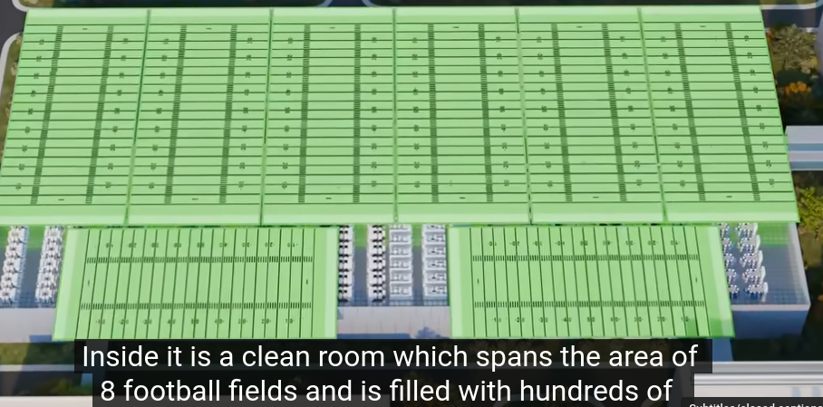

hundreds of machines sizes range from van to bus
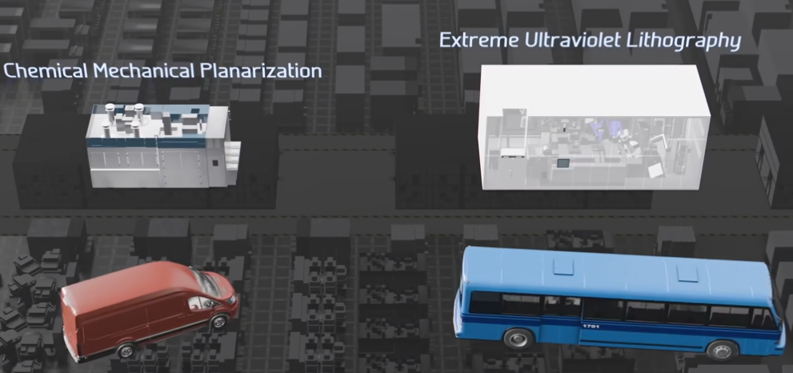
chemical mechanical planarization cost: 3.5mil
extreme ultraviolet lihography cost: 170mil

wafers undergo 1000 or so steps in 3 months
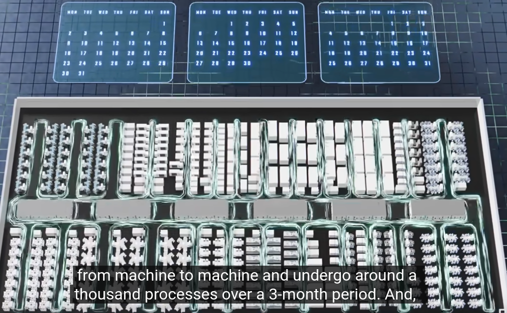
one wafer, hundreds of chips, each contains 26b transistors. each are cut out, tested, packaged into computers.

To build a 80 layer microchip, 940 steps over 3 months on 435 tools. Doing batch processing.

How many can one cleanroom produce per month?
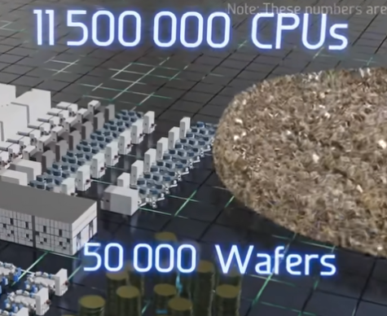
overview of a cleanroom
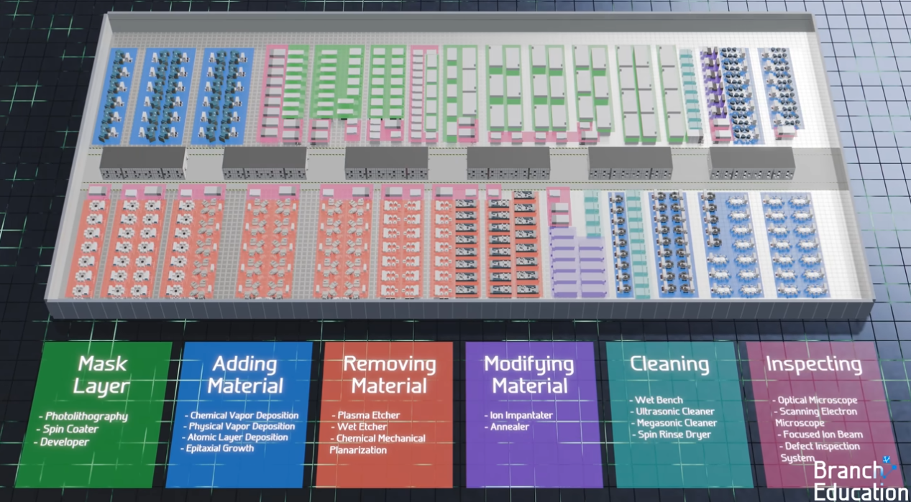

Overview
========

Left is how 3D structure of chips are built
Right is how machines in cleanrooms work
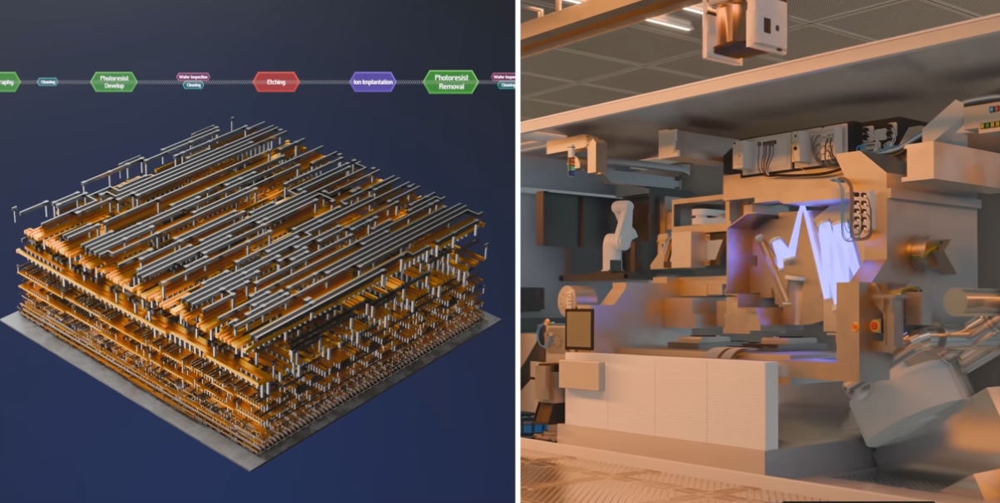

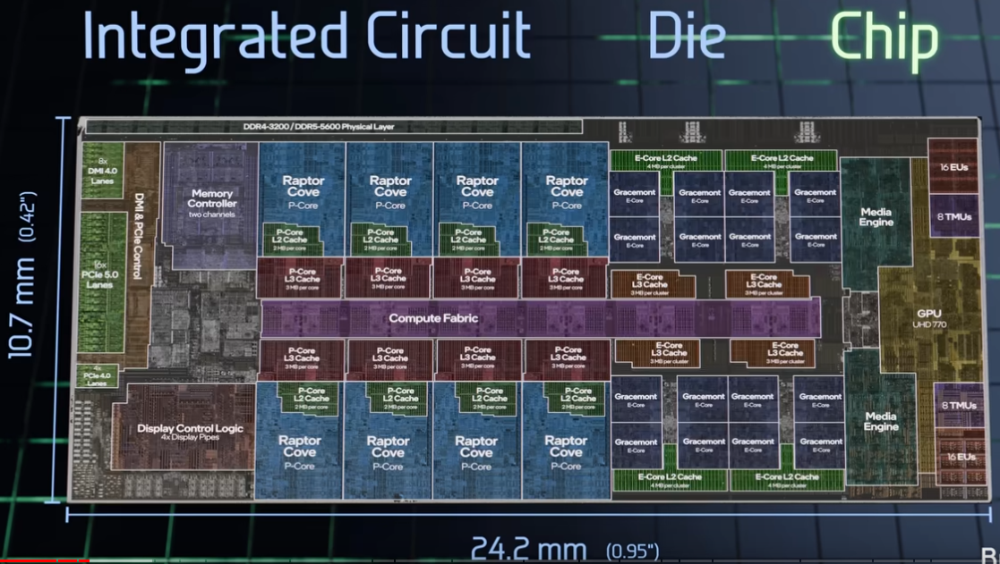
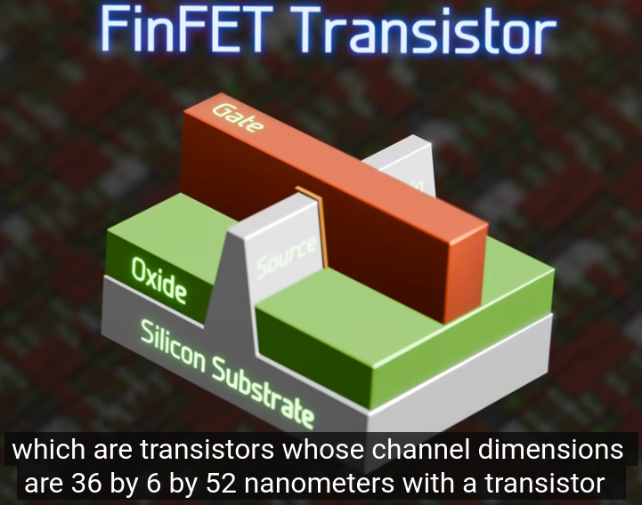

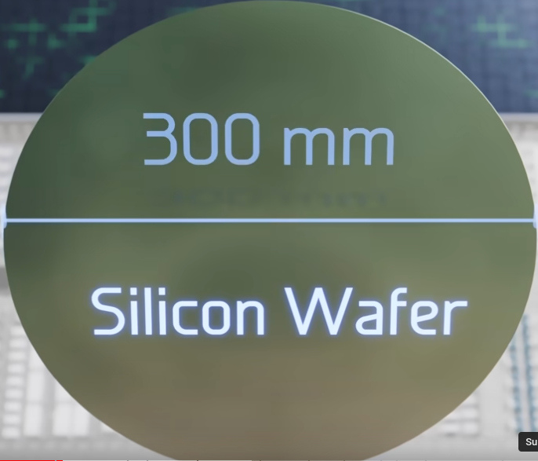
0.75mm thick, barcode and small notch indicating direction of lattice

single wafer costs around $100
but it makes 230 chips, one CPU on average $552, making it ten times more valuable than the gold of the same weight.
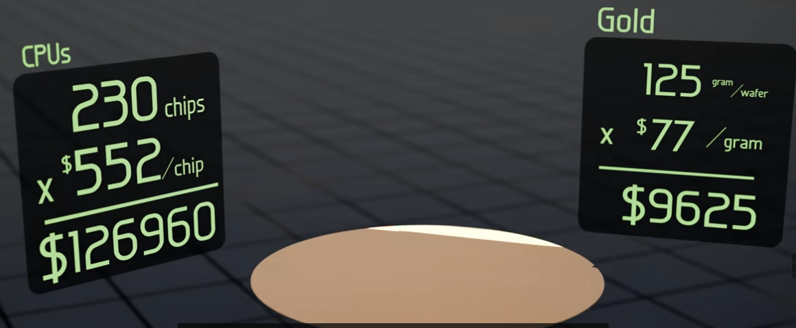
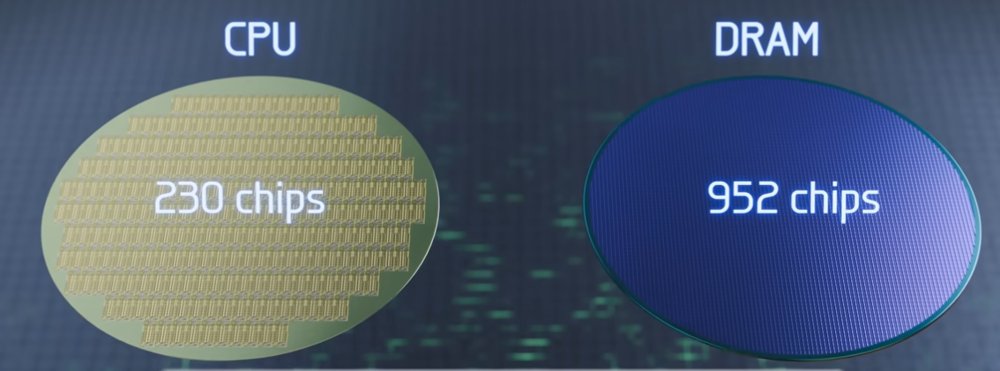

Mask Layer
==========
purpose: build nanoscopic stencil
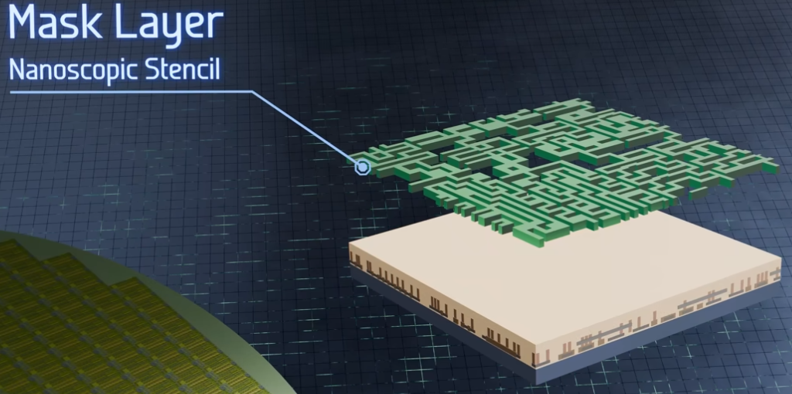

EUV Photolithography tool is the key
photomask is 6x6inch
can fit two copies of a single CPU layer
80 masklayers each cost $300,000
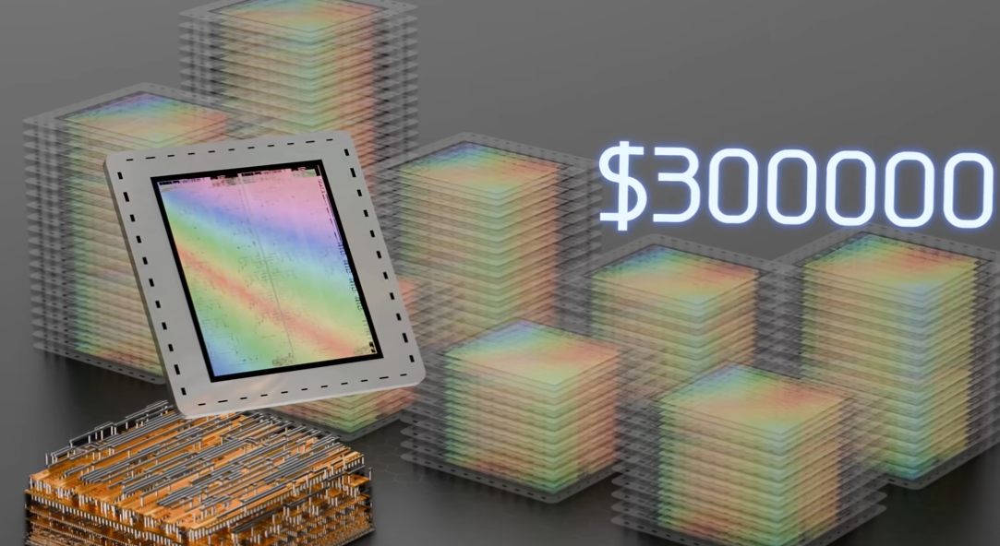

Deposition Tools
================
add/remove material to wafer

to add stuff is like spray painting
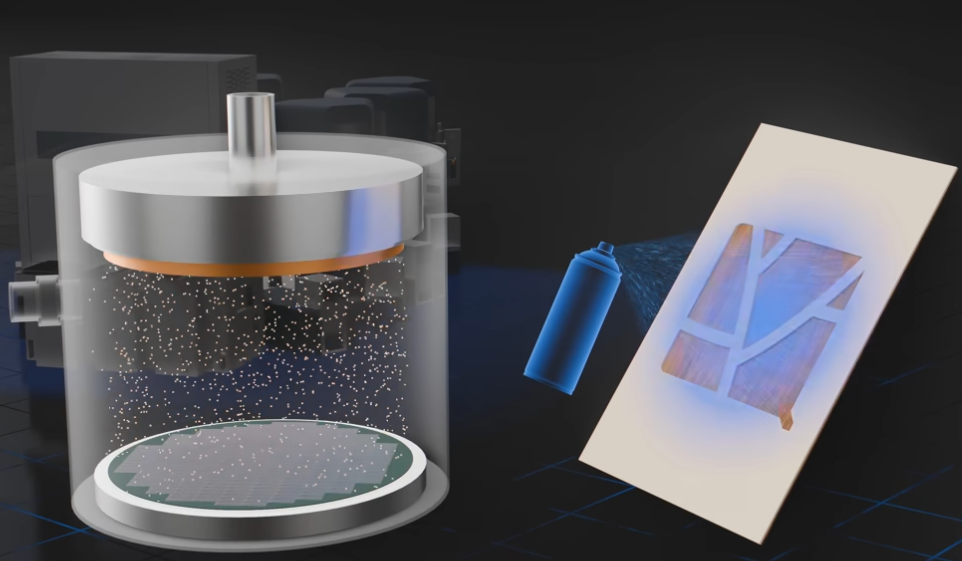
three major types of material
metal: copper/tantalum
insulator: oxides
crystalline layers of silicon
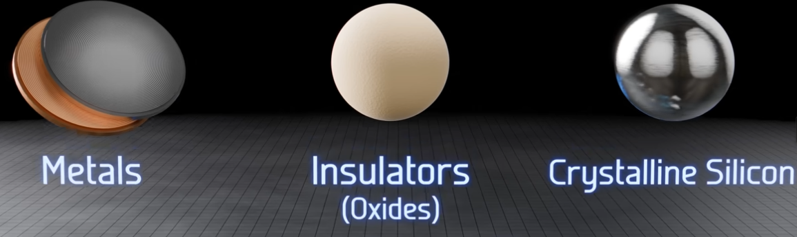
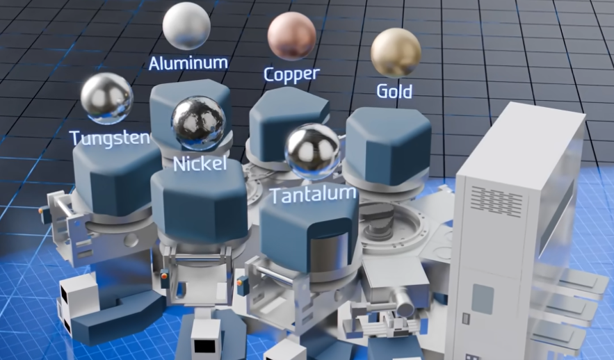

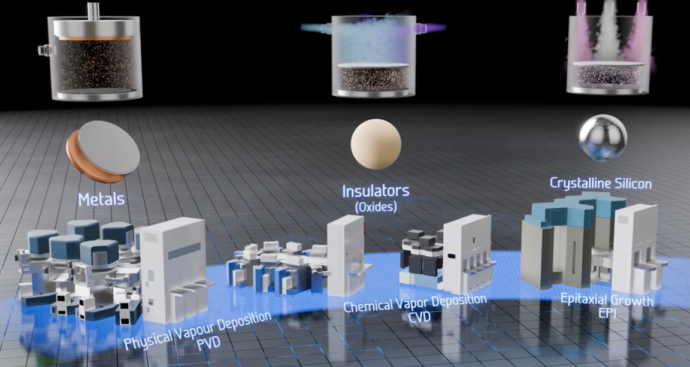

Etching tool
============
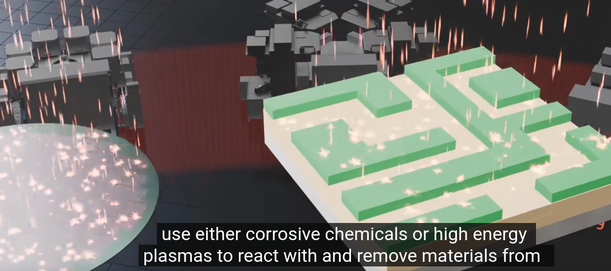
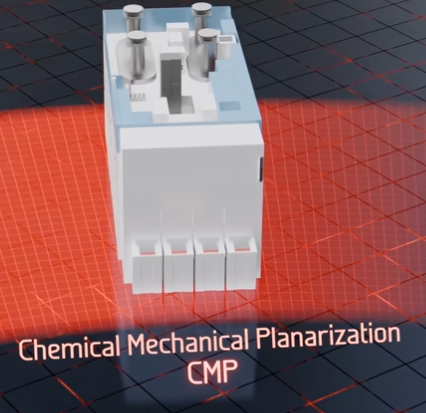
CMP:抛光打磨
Ion Implanter modifies silicon
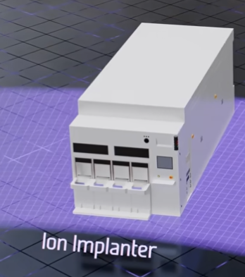
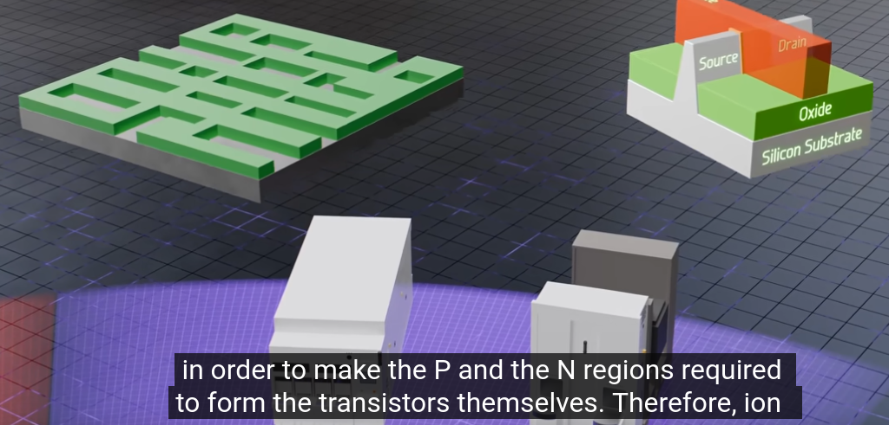
Ion implanter destory silicon,
need anealer to repair by heating the wafer.
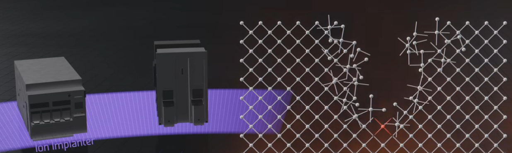

Cleaners
========
wafer washers: use ultra-pure water
dry with  nitrogen/isopropanol

Metrology
=========
inspect wafers
uses scanning electron microscope to take pictures of the top surface of the wafer

important: nanometer-level precision

Chip companies are usually very secretive about transistor recipe, tool layout and process steps
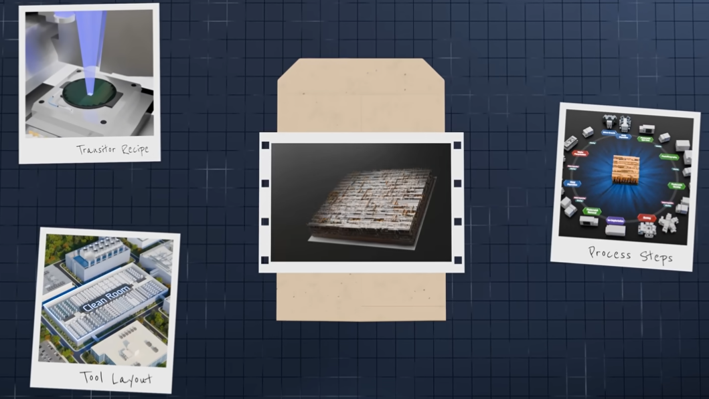

i9 i7 i5 i3 are so-called due to number of cores are defected! OMG.

H100 economics as estimated by Ben Spector

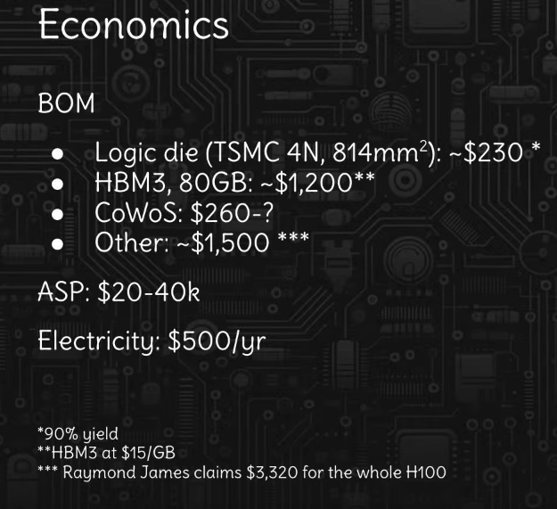

So almost 90% profit rate. (listed price of H100 being $30k)
