controlnet

MLSD - furniture arrangement / house repaint
Depth
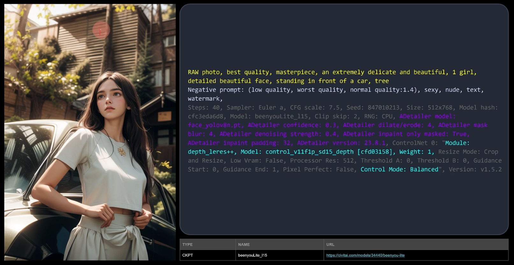
Normal map, good for face
normal_bae: no bg, normal_midas: w/ bg
mediapipe: can be used to generate character sheet
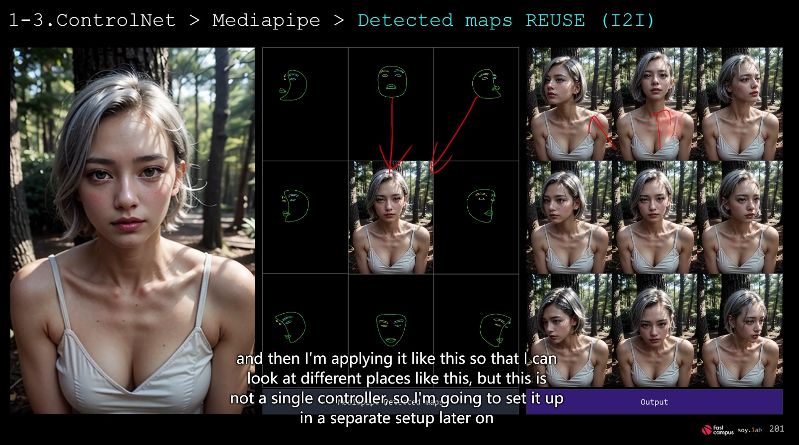
IP2P: character with minimal bg
make it {scenes}
will create differet bgs
change haircolor
change outfit?
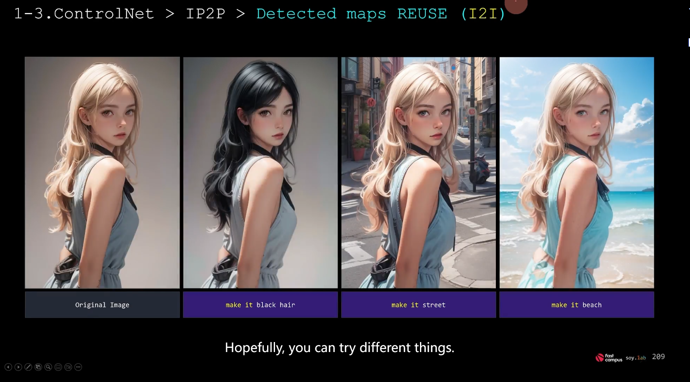
Tile resample: sementic preserving upscaler
Can be used to hide characters inside
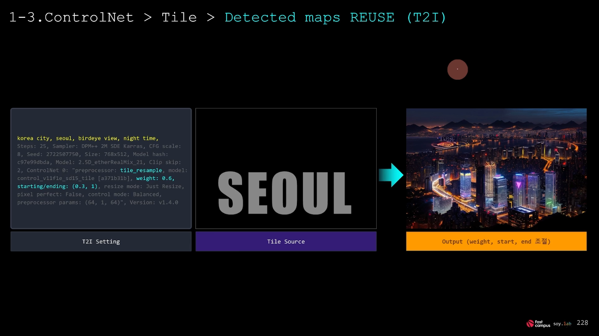
reference: can be used to force image style
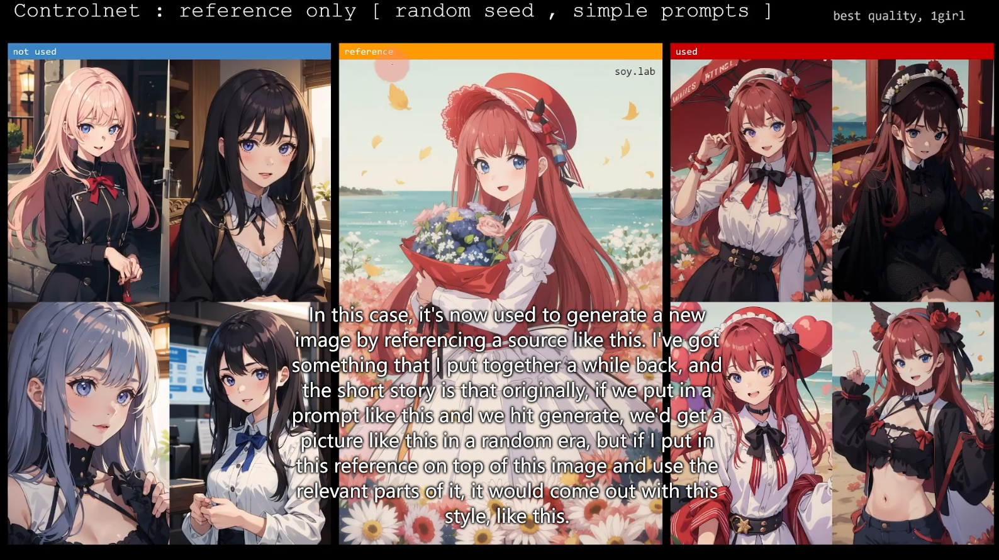
One really good looking example:
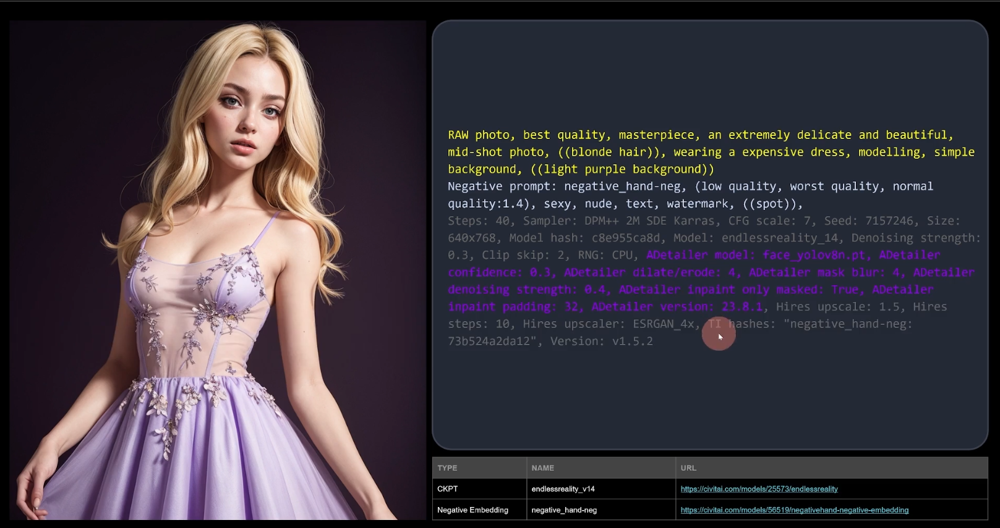
T2IA: redecoration of an indoor scene
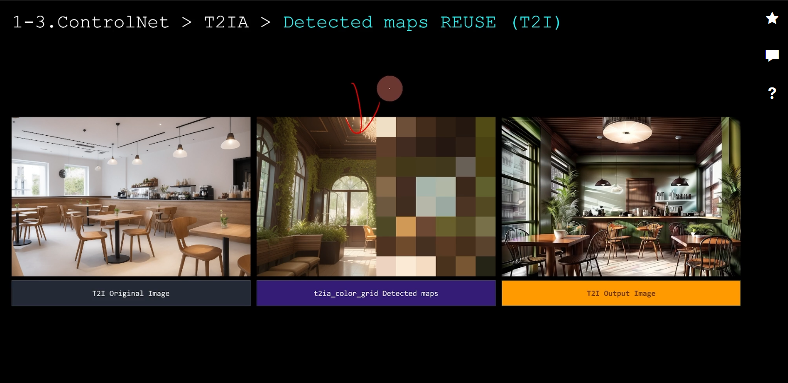
inpaint: use for details, esp w/ sketch
seg: use for re-textured scenes
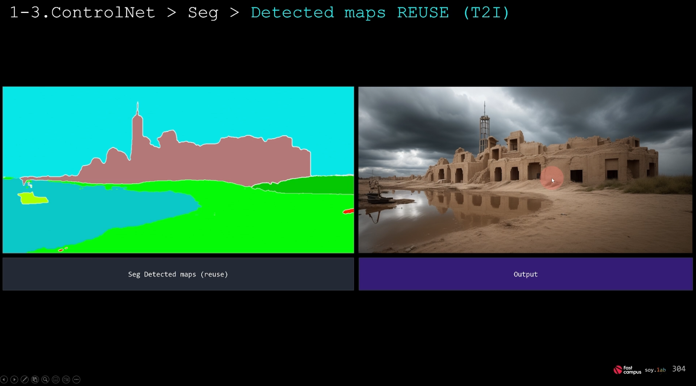
use [reference color code map](https://docs.google.com/spreadsheets/d/1se8YEtb2detS7OuPE86fXGyD269pMycAWe2mtKUj2W8/edit#gid=0) to set the scene.

Advanced Techniques:
====================

Camera:
-------

Camera view with prompt
Add "facial" in prompt to get a face only profile picture.
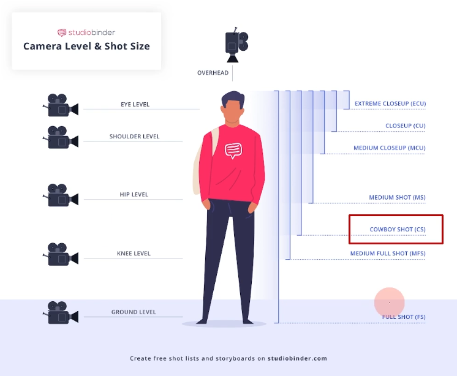
Add "cowboy hat" in negative prompt to remove cowboy hat for cowboy shot.
I2I inpaint mask: original or latent noise
extreme closeup is like your bae is just a breathe away face to face w u.
knee shot is good
use controlnet openpose to control camera view
openpose controlnet weight can be 1
normalmap and depthmap can use 0.5
normalmap should go with pixel perfect on
sometimes need to remove the head part for depthmap

[concept1:concept2:{step_number}] will use concept1 in the prompt for steps < step_number, and use concept2 in the prompt for steps > step_number.
concept1: beautiful mexican girl
concept2: black skin

change facial expression
------------------------

1. t2i first, then use controlnet (openpose + canny (edit out face region) + inpaint) with additional prompt:
(smile:0.6)

2. i2i: raw img, use just resize, use 1 denoise for cartoon, use 0.7 for realphoto. openpose + canny (edit out face region). inpaint use just resize, inpaint masked, origin, whole picture.
use prompt to only describe facial expression:
smile, best quality
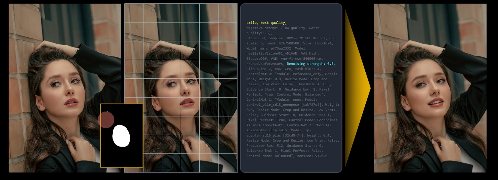
for real photo: cnet0 reference only 0.9 balanced, cnet1 openpose 0.6 controlnet important, cnet2 ip-adapter 0.4 

changing gaze
-------------

iDirection LoRA
draw eye outlines and eyeball in photoshop
will serve as the mask
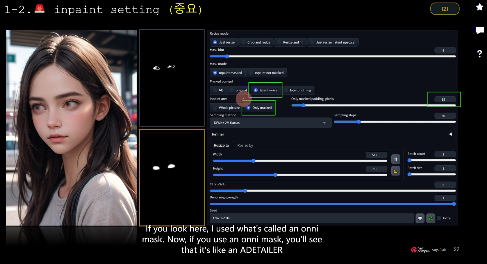
that's a lineart controlnet

ADetailer + LoRA
----------------
use openpose + reference to guide the pose
put face-related lora to adetailer, add facial expression prompt such as "smile" to adetailer also
use inpainting denoise strength to control how close to the original face
use adetailer's x/y offset and dilate/erode to control the size and position of the mask
put negative_hand.neg embedding to adetailer's 2nd hand fix.
use yolo hand.
for adetailer 2nd hand pass:
denoise strength: 0.35
step: 30
CFG: 3
need openpose for hand fix too.

Can add 3rd: eye, and 4th: body!

Pose Advanced
-------------
I2I highres fix, use CFG 3, denoise strength to 0.35/0.36
use openpose controlnet and reference only controlnet
I2I mode: just resize

use Lora block weight to finetune the style/pose

Lighting
========

adjust timing
-------------
purely prompt space:
afternoon, sunny day, blue sky
magic hour, pink and purple space
silhouette light, dark light, night, night sky

dreamy atmosphere
-----------------
god ray, cinematic lighting
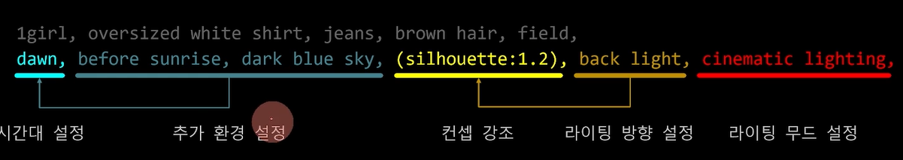
try a lot of mix and match
bloom and glow, ray tracing,
Rayleigh scattering, leaves blowing in the wind
fog, humid weather, cloudy
snowy day, rainy day
rainbow, bioluminescent lights
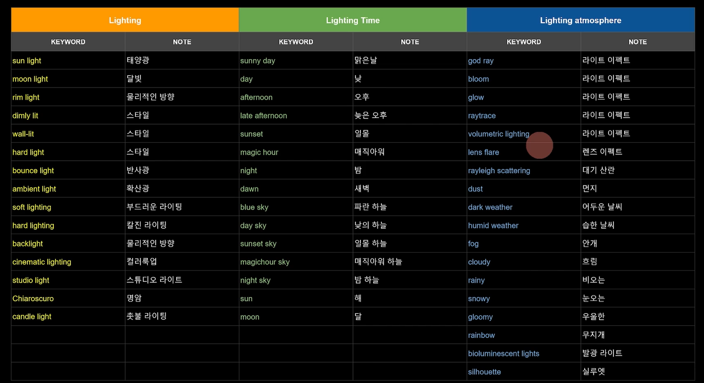

changing the light directly
---------------------------
IC-lighting could be a killer feature
openpose + canny + I2I source can also change lighting
Hires Fix
---------
Hires Fix can have its own ckpt, prompt and sampler.