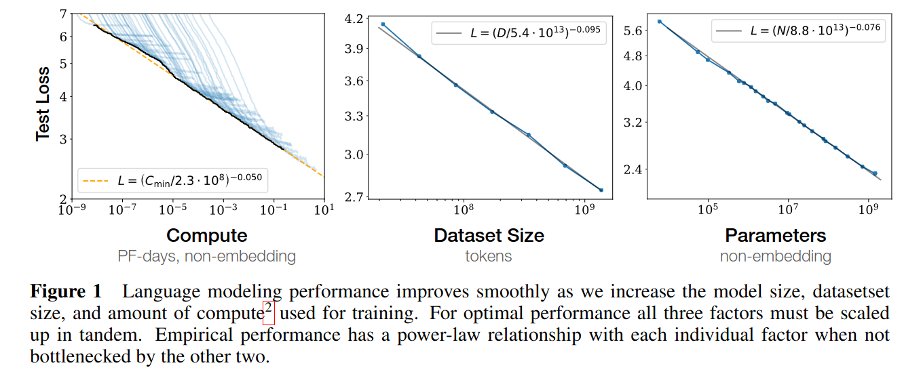
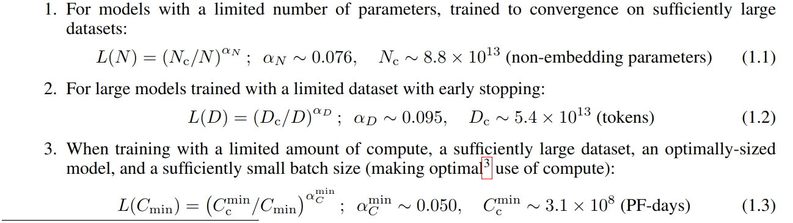
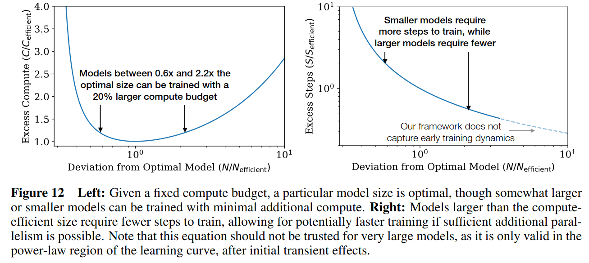
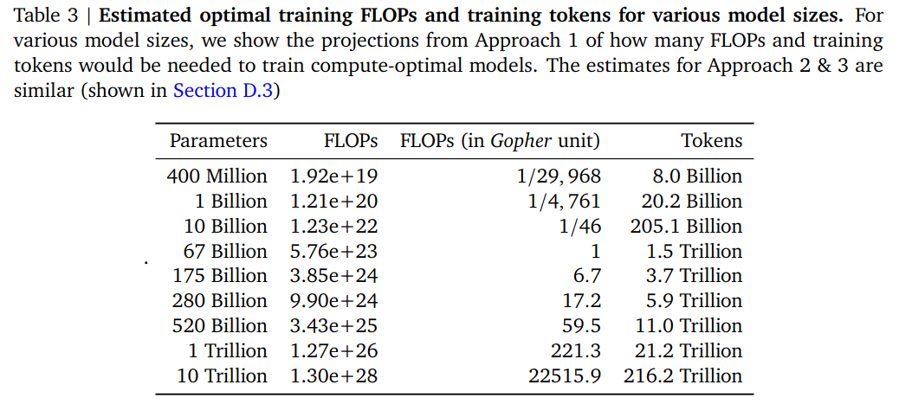

> todo

OpenAI:Kaplan20 paper, the origin of scaling law
----------------------

Language modeling performance depends on three factors:
 - Model architecture, the size and shape of neural models;
 - The computing power used to train them;
 - and the data available for this training process.
Throughout the paper shows a precise power-law scaling for performance as a function of training time, context length, dataset size, model size, and compute budget.

Conclusions:
 - performance depends strongly on scale, which consists of three factors: the number of model parameters N (excluding embeddings), the size of the dataset D, and the amount of compute C used for training.
 - Smoothe power laws: performance improves predictably as long as we scale up N and D in tandem. but enters a regime of diminishing returns if either N or D is held fixed while the other increases. Performance penalty depends predictably on the ratio $N^{0.74}/D$: every time we increase the model size 8x, we need to increase the data by roughly 5x to match the performance.
 - Sample efficiency: Large models are more sample-efficient than small models, reaching the same level of performance with fewer optimization steps.

Our results strongly suggest that larger models will continue to perform better, and will also be much more sample efficient than has been previously appreciated. Big models may be more important than big data. In this context, further investigation into model parallelism is warranted.

Deepmind:Chinchilla22 paper, the scaling law as we use today.
-------------------

we find that for compute-optimal training, the model size and the number of training tokens should be scaled equally: for every doubling of model size the number of training tokens should also be doubled.

The work revisit the question: Given a fixed FLOPs budget, how should one trade-off model size and the number of training tokens?
Model the final pre-training loss L(N,D) as a function of the number of model parameters N, and the number of training tokens, D.

Best Practice for LLM Model size
--------------------------------
1B-2B: fit for cellphone local model
6B-8B: fit for 12G-24G Consumer GPU deployment.
13B: if 4K input, DP=2 takes over an 8 GPU node, can be quantized to deploy on a single A10 or RTX4090
